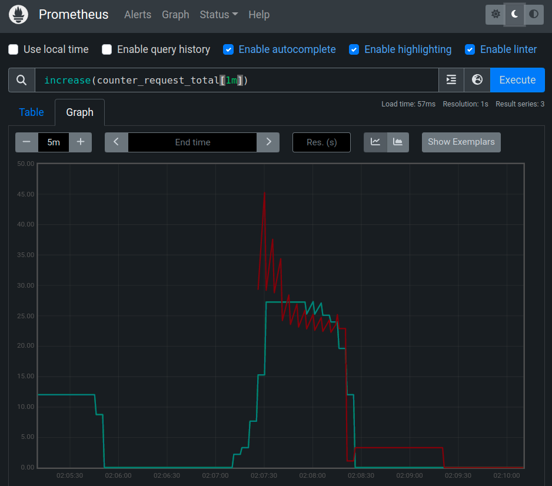
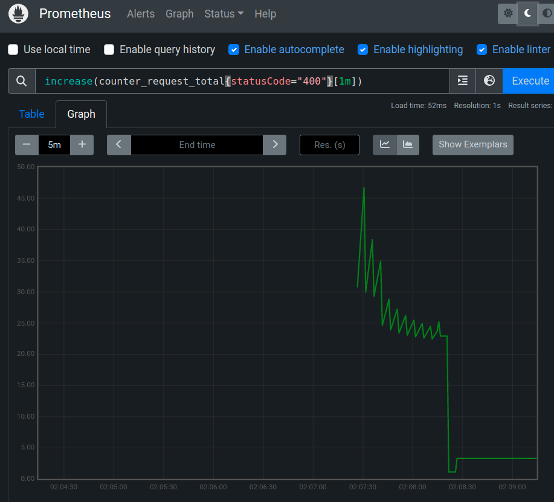
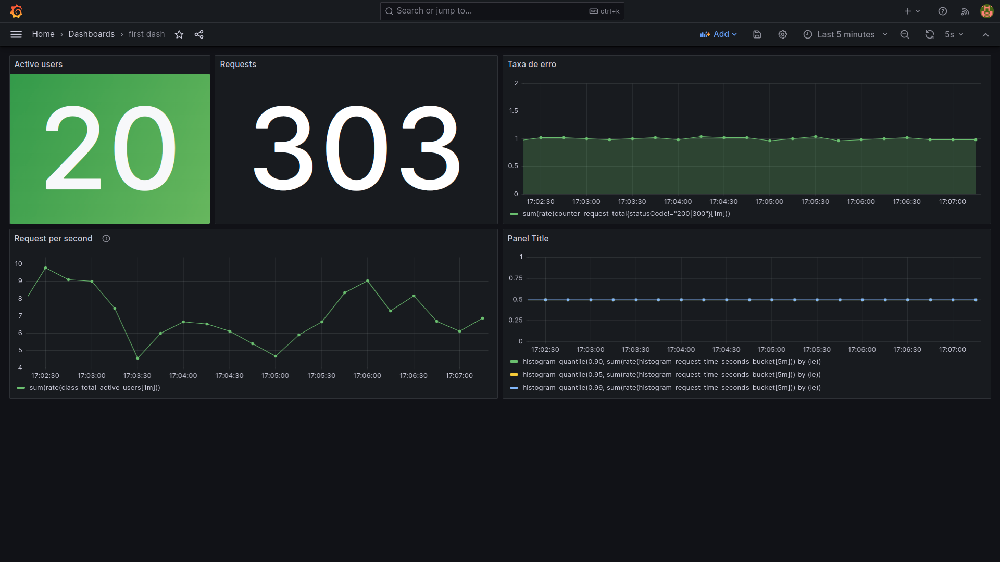

# Monitoring
> Create first monitoring system with Prometheus
### Docker run

```shell
docker run \
  --name prometheus \
  --rm \
  -d \
  -v ~/Desktop/www/prometheus/prometheus.yml:/etc/prometheus/prometheus.yml \
  -p 9090:9090 \
  prom/prometheus
```

```shell
docker run -d -p 3003:3000 --name=grafana --rm grafana/grafana
```

## Docker compose

```shell
chmod +x start.sh; ./start.sh; docker-compose --enf-file .env up -d
```

## MakeFile
> Unix

```shell
make up
```

To change the prometheus configuration it is necessary to map a dir file in the container (flag v)




**Create a filter with status code**



## PromQL

### Types
- Scalar
- Instant Vector
- Range Vector

*Vector* -> Time serie
> Searching for api_requests_total returns:

```js
http_request_total{method="POST", code="200"}
http_request_total{method="POST", code="400"}
http_request_total{method="POST", code="500"}
```

- **Instant vector**
> Filter in the instant moment

```js
api_request_total (@07/04/2023 23:34:00)
```

| serie                         | 07/04/2023 23:34:00 |
|-------------------------------|---------------------|
| api_request_total{code="200"} | 10                  |
| api_request_total{code="400"} | 2                   |
| api_request_total{code="500"} | 5                   |


- **Range vector**
> Filter by time range

```js
api_request_total[1m] (@07/04/2023 23:34:00)
```

| serie                         | 07/04/2023 23:33:15 | 07/04/2023 23:33:30 | 07/04/2023 23:33:45 | 07/04/2023 23:34:00 |
|-------------------------------|---------------------|---------------------|---------------------|---------------------|
| api_request_total{code="200"} | 4                   | 5                   | 2                   | 10                  |
| api_request_total{code="400"} | 1                   | 1                   | 5                   | 5                   |
| api_request_total{code="500"} | 1                   | 3                   | 5                   | 5                   |


```js
// changing the scrape interval (range of 4 minutes each 1 minute)
api_request_total[4m:1m] (@07/04/2023 23:34:00)
```

| serie                         | 07/04/2023 23:31:00 | 07/04/2023 23:32:00 | 07/04/2023 23:33:00 | 07/04/2023 23:34:00 |
|-------------------------------|---------------------|---------------------|---------------------|---------------------|
| api_request_total{code="200"} | 4                   | 5                   | 2                   | 10                  |
| api_request_total{code="400"} | 1                   | 1                   | 5                   | 5                   |
| api_request_total{code="500"} | 1                   | 3                   | 5                   | 5                   |


## Implements Grafana

